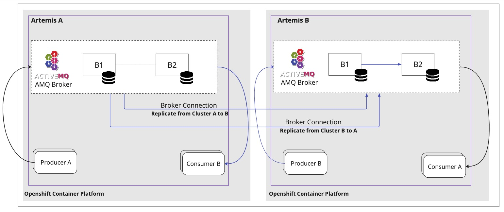
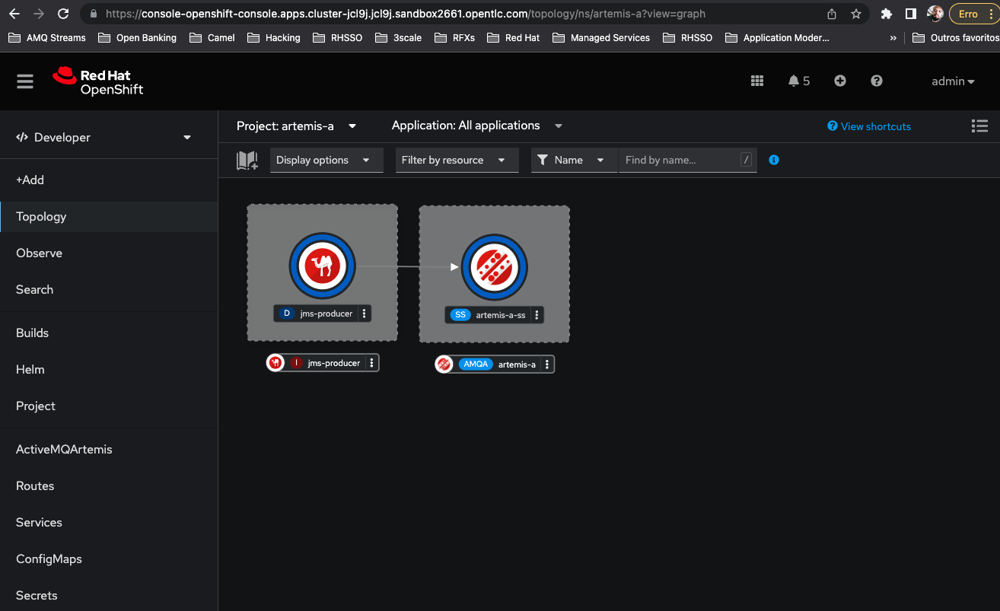
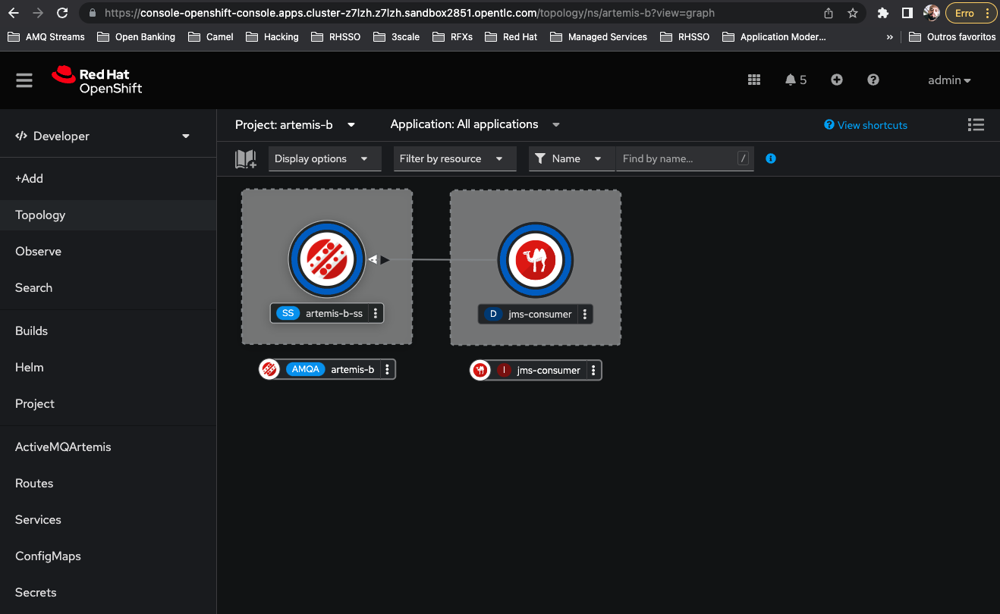
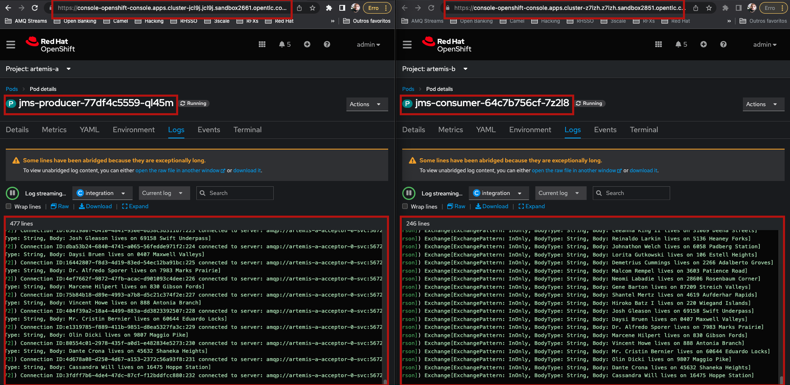

= ActiveMQ Artemis Message Replication (Mirroring)

ActiveMQ Artemis - Red Hat AMQ Broker mirroring application.

The mirroring application replicates data using AMQP protocol. 
It's used for multi-site, fault-toralent messaging using broker connections.

For more information, check https://access.redhat.com/documentation/en-us/red_hat_amq_broker/7.10/html/configuring_amq_broker/configuring-fault-tolerant-system-broker-connections-configuring#doc-wrapper[Red Hat AMQ Broker docs].

Camel K application producing messsages to the `person` topic in the `Data center A`.

Camel K application consuming messsages from the `person` topic in the `Data center B`. Those messages are being replicated by the AMQ Broker mirroring feature via `AMQP`

Split screen with messages being produced in the left and imediately consumed in the other DC in the right

== Operators installed 

* AMQ Broker Operator
* Camel K 

== Install The Demo Using Ansible

=== Parameters

[options="header"]
|=======================
| Parameter      | Example Value                                      | Definition
| dc_a_token     | sha256~vFanQbthlPKfsaldJT3bdLXIyEkd7ypO_XPygY1DNtQ | access token for DC A a user with cluster-admin privileges
| dc_b_token     | sha256~vFanQbthlPKfsaldJT3bdLXIyEkd7ypO_XPygY1DNtQ | access token for DC B a user with cluster-admin privileges
| dc_a_server    | https://api.mycluster.opentlc.com:6443             | OpenShift DC A Cluster API URL
| dc_b_server    | https://api.mycluster.opentlc.com:6443             | OpenShift DC B Cluster API URL
| external    | false             | false indicates that clusters are in the same Openshift.
|=======================

=== Deploying the demo
----
export dc_a_token="sha256~lw63JyetyJUJ3_pGRc-LkXGM4p3lmpvn4nj2TcdCeAI"
export dc_b_token="sha256~vSpunJJ6eaX4AxuDwPVlpT7BzeLkWYU3duBEJTWJKFE"
export dc_a_server=https://api.cluster-jcl9j.jcl9j.sandbox2661.opentlc.com:6443
export dc_b_server=https://api.cluster-z7lzh.z7lzh.sandbox2851.opentlc.com:6443
export external=true

cd ansible
ansible-playbook -e dc_a_token=${dc_a_token} -e dc_b_token=${dc_b_token} -e dc_a_server=${dc_a_server} -e dc_b_server=${dc_b_server} -e external=${external} playbook.yml
----

== Certificates

At this time certs are not automated, so you have to create it by yourself.

=== DC A

* Generate a self-signed cert for broker keystore (better use a known CA)

----
$ keytool -genkey -alias broker -keyalg RSA -keystore ./broker.ks \
    -validity 730 -keysize 2048 \
    -ext "SAN=DNS:artemis-a-mirror-0-svc-rte-artemis-a.apps.cluster-jcl9j.jcl9j.sandbox2661.opentlc.com,DNS:artemis-a-mirror-0-svc-rte-artemis-a.artemis-a.svc.cluster.local" \
    -dname "CN=Rodrigo Ramalho, OU=RH, O=RedHat, L=Brasilia, ST=DF, C=BR" \
    -keypass "abc123" \
    -storepass "abc123"

$ keytool -export -alias broker -keystore ./broker.ks -file ./broker.der -storepass "abc123" -keypass "abc123"
$ openssl x509 -inform der -in broker.der -noout -text
---- 

* !Important! remember to import both broker certs into the client.ts
* Create a trust store for the client

----
$ keytool -import -alias artemis-a-broker -keystore ./client.ts -file ./broker.der -storepass "abc123" -keypass "abc123" -noprompt
$ keytool -import -alias artemis-b-broker -keystore ./client.ts -file ../dc-b/broker.der -storepass "abc123" -keypass "abc123" -noprompt
----    

* Create a secret to store TLS credentials (pass from prev steps w/keytool)

----
roles/amq-broker/files/certs/dc-a
$ oc create secret generic artemis-a-mirror-secret \
    --from-file=broker.ks=./broker.ks \
    --from-file=client.ts=./client.ts \
    --from-literal=keyStorePassword=abc123 \
    --from-literal=trustStorePassword=abc123
----

=== DC B

Generate a self-signed cert for broker keystore (better use a known CA)

----
// output broker.ks 
$ keytool -genkey -alias broker -keyalg RSA -keystore ./broker.ks \
    -validity 730 -keysize 2048 \
    -ext "SAN=DNS:artemis-b-mirror-0-svc-rte-artemis-b.apps.cluster-z7lzh.z7lzh.sandbox2851.opentlc.com,DNS:artemis-b-mirror-0-svc-rte-artemis-b.artemis-b.svc.cluster.local" \
    -dname "CN=Rodrigo Ramalho, OU=RH, O=RedHat, L=Brasilia, ST=DF, C=BR" \
    -keypass "abc123" \
    -storepass "abc123"

// output broker.der
$ keytool -export -alias broker -keystore ./broker.ks -file ./broker.der -storepass "abc123" -keypass "abc123"
$ openssl x509 -inform der -in broker.der -noout -text
----

* !Important! remember to import both broker certs into the client.ts
* Create a trust store for the client

----
// output client.ts
$ keytool -import -alias artemis-b-broker -keystore ./client.ts -file ./broker.der -storepass "abc123" -keypass "abc123" -noprompt
$ keytool -import -alias artemis-a-broker -keystore ./client.ts -file ../dc-a/broker.der -storepass "abc123" -keypass "abc123" -noprompt
----

Check if there are 2 entries in the trustore

----
keytool -list -keystore client.ts
----

* Create a secret to store TLS credentials (pass from prev steps w/keytool)

----
cd roles/amq-broker/files/certs/dc-b
$ oc create secret generic artemis-b-mirror-secret \
    --from-file=broker.ks=./broker.ks \
    --from-file=client.ts=./client.ts \
    --from-literal=keyStorePassword=abc123 \
    --from-literal=trustStorePassword=abc123
----

== Producer

In the DC A - artemis-a project, start the producer:

----
cd jms-producer
oc project artemis-a
oc delete configmap jms-sink-config
oc create configmap jms-sink-config --from-file configs/application.properties
kamel run --config configmap:jms-sink-config -d mvn:org.amqphub.quarkus:quarkus-qpid-jms --dev JmsProducer.java
----

== Consumer 

In the DC B - artemis-b project, start the consumer:

----
cd jms-consumer
oc project artemis-b
oc delete configmap jms-source-config
oc create configmap jms-source-config --from-file configs/application.properties
kamel run --config configmap:jms-source-config -d mvn:org.amqphub.quarkus:quarkus-qpid-jms --dev JmsConsumer.java
----

== TODO 

* Automate certs generation
* Automate secret creation pointing to certs
* Automate the deploy of producer and consumer

./artemis producer --url tcp://artemis-broker-hdls-svc:61616 --destination person --message-count 10